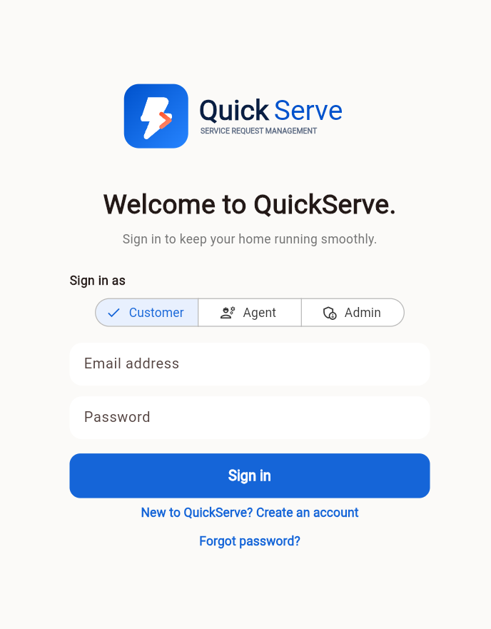
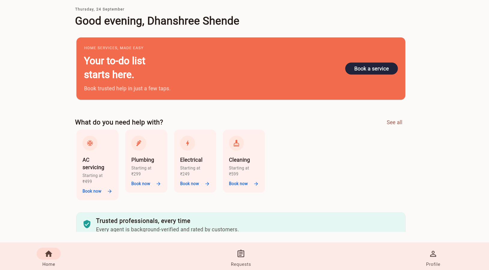
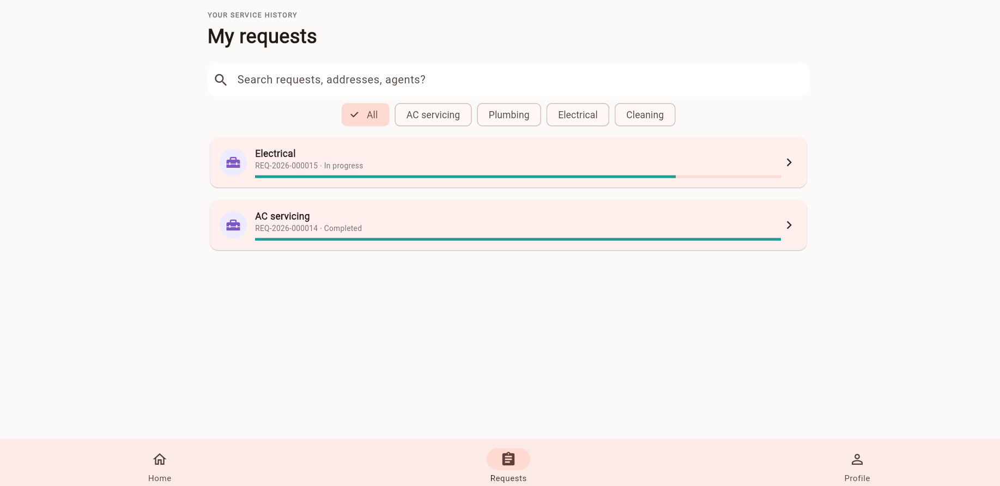
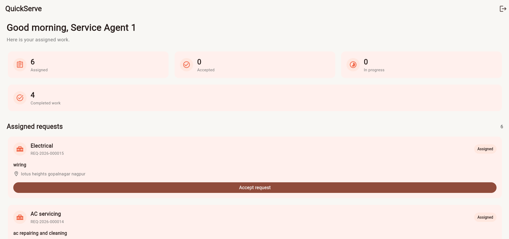
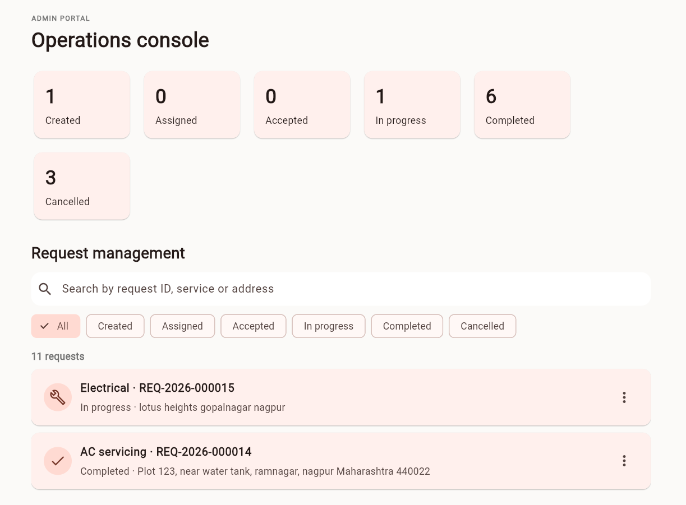
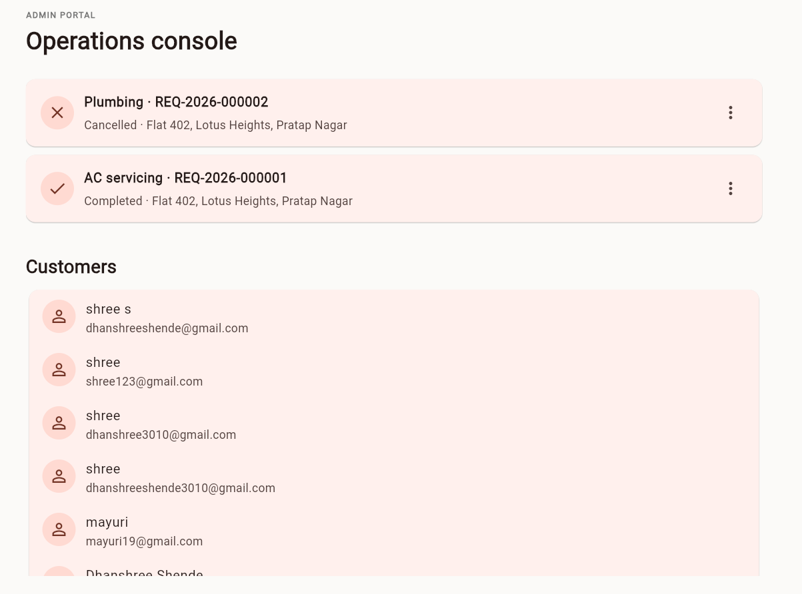
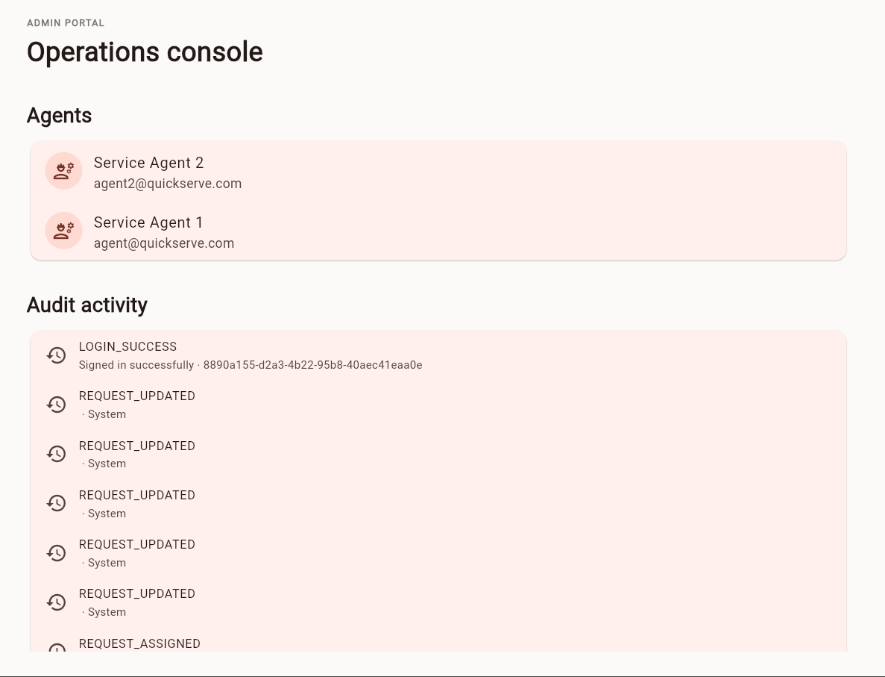

# QuickServe — Service Request Management System

QuickServe is a full-stack Service Request Management application built for the **Swasiq Technology Internship Technical Assignment**.

The application provides separate workflows for **Customers, Service Agents, and Administrators**, using Flutter for the application and responsive web portal, with Supabase and PostgreSQL as the backend.

The project focuses on secure role-based access, service-request lifecycle management, backend authorization, audit logging, error handling, responsive UI, testing, and maintainable project structure.

---

## 1. Project Overview

QuickServe manages service requests for common household services:

- AC Servicing
- Plumbing
- Electrical
- Cleaning

The application connects three types of users:

**Customer → creates and tracks requests**

**Service Agent → manages assigned work**

**Administrator → manages requests, users, assignments, and activity**

### Request Lifecycle

```text
CREATED → ASSIGNED → ACCEPTED → IN_PROGRESS → COMPLETED
```

Eligible requests can also be cancelled:

```text
CREATED / ASSIGNED → CANCELLED
```

Each request receives a unique identifier such as:

```text
REQ-2026-000123
```

---

## 2. Key Features

### Customer

- Registration and login
- Password reset
- Session persistence
- Browse available services
- Create service requests
- Select service type
- Enter service description
- Select preferred date and time
- Enter service address
- Select priority: Low / Medium / High
- View own requests
- Track request status
- View request details
- Cancel eligible requests
- Profile and logout

### Service Agent

- Secure login
- View assigned service requests
- Accept assigned requests
- Update request status
- Add optional notes during status updates
- View completed work
- View request details

### Administrator

- Responsive Flutter Web administration portal
- Dashboard with request statistics
- Request management
- Search and filtering
- View request details
- Assign agents
- Update request status
- View customers
- View agents
- Review audit/activity information

---

## 3. Technology Stack

| Layer | Technology |
|---|---|
| Application | Flutter / Dart |
| Web Admin Portal | Flutter Web |
| UI | Material 3 |
| Authentication | Supabase Auth |
| Backend | Supabase |
| Database | PostgreSQL |
| Authorization | PostgreSQL Row Level Security (RLS) |
| State / Repository Layer | AppState |
| Local Persistence | shared_preferences |
| Environment Configuration | flutter_dotenv |
| Date / Time | intl |
| Request IDs | uuid |
| SVG Assets | flutter_svg |
| Testing | flutter_test |
| Version Control | Git / GitHub |

---

## 4. Architecture

QuickServe uses a shared Flutter codebase for the customer, service-agent, and administrator experiences.

### Architecture Approach

The application separates UI concerns from backend and data operations through the `AppState` layer.

```text
Flutter UI
    ↓
AppState / Repository Boundary
    ↓
Supabase Auth + PostgreSQL
    ↓
RLS / Database Authorization
```

The Flutter UI controls presentation and user interaction, while backend policies provide the final authorization boundary.

UI visibility is therefore not treated as the security mechanism.

---

## 5. User Roles & Authorization

QuickServe implements three roles:

| Capability | Customer | Agent | Admin |
|---|:---:|:---:|:---:|
| Register / Login | ✓ | ✓ | ✓ |
| Create Request | ✓ | — | ✓ |
| View Own Requests | ✓ | ✓ | ✓ |
| View All Requests | — | — | ✓ |
| Manage Assigned Requests | — | ✓ | ✓ |
| Assign Agents | — | — | ✓ |
| Manage Operational Data | — | Assigned only | ✓ |
| View Audit Activity | — | — | ✓ |

Authorization is enforced at the backend/database layer using **Supabase Row Level Security (RLS)** and guarded database operations.

Examples include:

- Customers can access only their own service requests.
- Agents can manage requests assigned to them.
- Administrators can access operational data required for administration.

---

## 6. Request Creation

Customers can create a service request by providing:

- Service type
- Description
- Preferred date
- Preferred time
- Complete service address
- Priority: Low / Medium / High

The application generates a unique request ID.

Example:

```text
REQ-2026-000011
```

Date and time are selected using Flutter date and time picker interactions.

---

## 7. Request Lifecycle Management

The request state is controlled through defined lifecycle transitions.

```text
CREATED
   │
   ▼
ASSIGNED
   │
   ▼
ACCEPTED
   │
   ▼
IN_PROGRESS
   │
   ▼
COMPLETED
```

Eligible requests can also be cancelled from supported states:

```text
CREATED / ASSIGNED → CANCELLED
```

Status changes are recorded through the request status history mechanism.

This allows the application to maintain both the current request state and the history of lifecycle changes.

---

## 8. Database Design

The Supabase PostgreSQL database contains the core entities required for the application.

### Main Entities

```text
profiles
    │
    ├───────────────┐
    │               │
    ▼               ▼
customers       agents
    │               │
    └───────┬───────┘
            ▼
    service_requests
            │
       ┌────┴─────┐
       ▼          ▼
request_status   audit_logs
_history
```

### profiles

Stores application users and their roles.

Roles include:

- CUSTOMER
- AGENT
- ADMIN

### services

Stores the available service categories:

- AC Servicing
- Plumbing
- Electrical
- Cleaning

### service_requests

Stores the main service-request record, including:

- Request ID
- Customer
- Assigned agent
- Service
- Description
- Preferred date/time
- Address
- Priority
- Current status
- Created timestamp

### request_status_history

Stores request lifecycle transitions and status-change information.

### audit_logs

Stores meaningful application and security events such as:

- `LOGIN_SUCCESS`
- `REQUEST_CREATED`
- `REQUEST_ASSIGNED`
- `REQUEST_UPDATED`
- `AUTHORIZATION_FAILED`
- `DATABASE_ERROR`

The database schema also contains supporting indexes, constraints, guarded database operations, and supporting tables.

---

## 9. Security

Security is implemented at multiple layers.

### Authentication

Supabase Auth handles:

- Registration
- Login
- Logout
- Session persistence
- Password reset

### Backend Authorization

Supabase PostgreSQL Row Level Security (RLS) is used to enforce access boundaries.

Examples:

- Customers can access only their own service requests.
- Agents can manage requests assigned to them.
- Administrators can access operational data required for administration.

### Defense in Depth

The application uses UI-level role restrictions for the user experience, while backend/database authorization remains the authoritative security layer.

### Secrets

Sensitive configuration is stored through environment configuration.

Passwords, authentication tokens, API keys, and other secrets are not committed to the repository or written to audit logs.

---

## 10. Audit Logging

QuickServe records meaningful operational and security events.

Examples include:

```text
LOGIN_SUCCESS
REQUEST_CREATED
REQUEST_ASSIGNED
REQUEST_UPDATED
AUTHORIZATION_FAILED
DATABASE_ERROR
```

Audit information allows administrators to review important activity associated with the service-request workflow.

---

## 11. Error Handling

The application handles common failure scenarios including:

- Invalid input
- Authentication failures
- Unauthorized operations
- Backend/database failures
- Invalid request lifecycle transitions
- Network/backend errors

User-facing errors are presented as safe messages without exposing sensitive backend information.

---

## 12. Screenshots

The following screenshots demonstrate the main application workflows.

### Login



### Customer Home



### Request Details



### Agent Dashboard



### Admin Dashboard



### Admin — Customers & Agents



### Admin — Audit Activity



---

## 13. Project Structure

```text
quickserve/
│
├── lib/
│   ├── main.dart
│   ├── models/
│   │   └── domain.dart
│   └── services/
│       └── app_state.dart
│
├── assets/
│   └── images/
│       └── quickserve_logo.svg
│
├── docs/
│   ├── architecture.md
│   └── screenshots/
│       ├── login.png
│       ├── customer-home.png
│       ├── request-details.png
│       ├── agent-dashboard.png
│       ├── admin-dashboard.png
│       ├── admin-users.png
│       └── admin-audit.png
│
├── test/
│   └── widget_test.dart
│
├── supabase_schema.sql
├── env.example
├── pubspec.yaml
└── README.md
```

---

## 14. Local Setup

### Prerequisites

Install:

- Flutter 3.24+
- Dart 3.5+
- Git

### Clone the Repository

```bash
git clone https://github.com/Dhanshreeshende/quickserve.git
cd quickserve
```

### Install Dependencies

```bash
flutter pub get
```

### Configure Environment

Create a `.env` file from the provided example:

```bash
cp env.example .env
```

Add the required Supabase configuration:

```env
SUPABASE_URL=your_supabase_project_url
SUPABASE_ANON_KEY=your_supabase_anon_key
```

Never commit the `.env` file.

### Run the Application

```bash
flutter run
```

### Run the Web Admin Portal

```bash
flutter run -d chrome
```

---

## 15. Testing

Run the Flutter test suite:

```bash
flutter test
```

Run static analysis:

```bash
flutter analyze
```

The project includes Flutter domain/widget tests covering core application behaviour.

Backend authorization and customer data isolation were also verified against the Supabase RLS policies during functional testing.

A customer-data isolation scenario was verified to ensure that a customer can access only their own service requests.

---

## 16. Test Accounts

The following demo accounts are available for evaluation:

| Role | Email |
|---|---|
| Customer | dhanshree30@gmail.com |
| Agent | agent@quickserve.com |
| Agent | agent2@quickserve.com |
| Admin | admin@quickserve.com |

Passwords are provided separately to the evaluator and are not committed to the repository.

---

## 17. Documentation & Repository

Additional project documentation is available in:

- `docs/architecture.md` — application architecture and RBAC overview
- `supabase_schema.sql` — database schema, policies, and backend configuration
- `env.example` — environment configuration template

The project is maintained using Git and GitHub with environment secrets excluded from version control.

### GitHub Repository

https://github.com/Dhanshreeshende/quickserve
