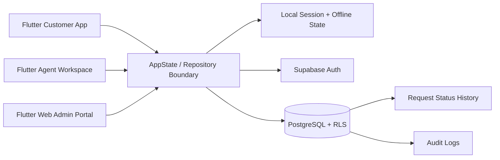

# QuickServe Flutter Architecture

The same Flutter codebase targets Android, iOS, and the responsive web admin portal. `AppState` owns UI-facing mutations and maps to Supabase when configured; local fallback keeps the demo reviewable without credentials. Supabase RLS is the authoritative authorization boundary.

## Data model

`profiles` stores `CUSTOMER`, `AGENT`, and `ADMIN` roles. `services` contains the four service types. `service_requests` references a customer, optional agent, and service. `request_status_history` records every lifecycle transition. `audit_logs` records login, creation, assignment, updates, authorization failures, and database errors. Indexes cover customer, agent, status, request ID, and created timestamp.

## RBAC

Customers can create and view only their own requests. Agents can view and manage assigned requests. Administrators can manage all operational data. The Flutter UI reflects those boundaries, while `supabase_schema.sql` applies RLS and guarded RPCs on the backend.
